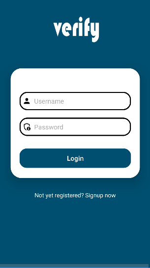
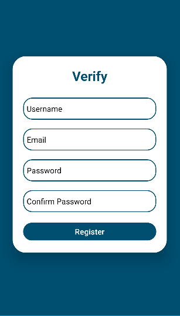
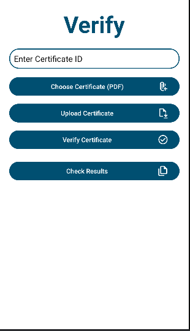

# Verify
An Android app built entirely in Java using Android Studio that enables users to upload and verify the credibility of certificates.

# Features
- User authentication: Register & Login User
- Certificate Upload page

# Tech Stack
- Java
- Firebase

# Project Screenshots

# Project Setup
1. Clone the project: `git clone git@github.com:CodeOmari/Verify.git`
2. Using Android Studio, open the project folder from its saved location
3. Run the project 

## ANY CONTRIBUTIONS TO THIS PROJECT ARE WARMLY WELCOMED.
